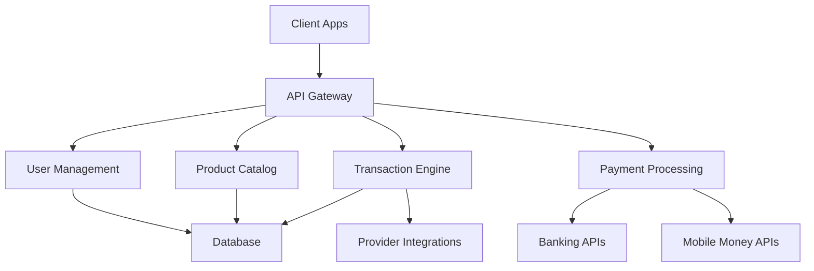
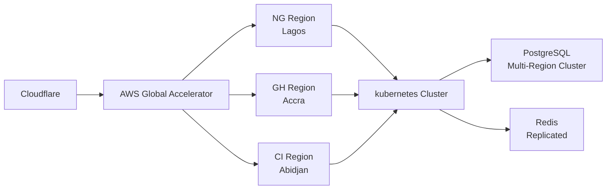

# Nexus_Top
NexusTop is a scalable web platform enabling users to buy mobile data and airtime instantly. Integrating MTN/Airtel/Flutterwave APIs, it features wallet management, real-time transactions, and admin analytics. Built with Django for security and performance, it serves telecom consumers with 99.9% uptime and sub-second processing. IT is also a comprehensive digital platform enabling seamless access to telecom services, financial transactions, and value-added services across all 16 West African nations. The platform integrates core functionality with localized adaptations to serve diverse regional requirements while maintaining a unified technical architecture.

**Core Objectives**:  
1. Provide single-point access to digital services for 400+ million people  
2. Bridge financial inclusion gaps across urban and rural areas  
3. Create a scalable infrastructure adaptable to country-specific regulations  
4. Develop an extensible platform for future service integrations  

---

## Core Functionality  

### Telecom Services  
| **Service** | **Description** | **Coverage** |  
|-------------|-----------------|--------------|  
| **Airtime Top-ups** | Instant mobile credit recharge | All 16 countries |  
| **Data Bundles** | Customizable internet packages | 98% of networks |  
| **Cross-Network Gifting** | Send airtime/data to other users | All networks |  
| **Subscription Plans** | Recurring data/airtime packages | Phase 2 (Q4 2025) |  

### Financial Services  
| **Service** | **Description** | **Launch Phase** |  
|-------------|-----------------|------------------|  
| **P2P Transfers** | User-to-user money transfers | Phase 1 (Q3 2025) |  
| **Bank Transfers** | Direct to account transactions | Phase 1 (Q3 2025) |  
| **Mobile Money** | Wallet integrations | Phase 1 (Q3 2025) |  
| **Micro-Savings** | Group savings circles | Phase 2 (Q4 2025) |  
| **Cross-Border Remittances** | Regional money transfers | Phase 2 (Q4 2025) |  

### Value-Added Services  
| **Service** | **Description** | **Launch Phase** |  
|-------------|-----------------|------------------|  
| **Utility Payments** | Electricity, water bills | Phase 2 (Q4 2025) |  
| **Agricultural Marketplace** | Crop financing, produce sales | Phase 3 (Q1 2026) |  
| **Telemedicine** | Health consultations | Phase 3 (Q1 2026) |  
| **Education Platform** | Skill development courses | Phase 3 (Q1 2026) |  

---

## Technical Architecture  

### System Components  


### Core Stack  
| **Component** | **Technology** | **Purpose** |  
|---------------|----------------|-------------|  
| **Backend** | Django 5 + Django REST Framework | Core application logic |  
| **Database** | PostgreSQL 14 + TimescaleDB | Transactional and time-series data |  
| **Async Tasks** | Celery + Redis | Queue management |  
| **Frontend** | React 18 + Next.js | User interfaces |  
| **Infrastructure** | Kubernetes + AWS EKS | Container orchestration |  
| **Monitoring** | Prometheus + Grafana | Performance tracking |  

### Regional Adaptations  
```python
# Country-specific configuration module
COUNTRY_ADAPTERS = {
    'NG': {
        'currency': 'NGN',
        'payment_gateways': ['flutterwave', 'paystack'],
        'required_kyc': ['bvn'],
        'language': 'en'
    },
    'SN': {
        'currency': 'XOF',
        'payment_gateways': ['orange_money', 'wari'],
        'required_kyc': ['national_id'],
        'language': 'fr',
        'number_format': '{:,.2f} CFA'  # 1 000,00 CFA
    },
    # ... other country configurations
}

def get_country_config(country_code: str) -> dict:
    """Retrieve country-specific settings"""
    return COUNTRY_ADAPTERS.get(country_code, DEFAULT_CONFIG)
```

---

## Database Schema Highlights  

### Core Models  
```python
class User(AbstractBaseUser):
    email = models.EmailField(unique=True)
    phone = models.CharField(max_length=20)
    country = models.ForeignKey(Country, on_delete=models.PROTECT)
    is_verified = models.BooleanField(default=False)
    # ... other fields

class Product(models.Model):
    name = models.CharField(max_length=100)
    product_type = models.CharField(choices=[('DATA','Data'), ('AIRTIME','Airtime')])
    value = models.DecimalField(max_digits=10, decimal_places=2)  # GB or currency value
    price = models.DecimalField(max_digits=10, decimal_places=2)
    provider = models.ForeignKey(Provider, on_delete=models.CASCADE)
    country = models.ForeignKey(Country, on_delete=models.CASCADE)
    # ... other fields

class Transaction(models.Model):
    user = models.ForeignKey(User, on_delete=models.CASCADE)
    product = models.ForeignKey(Product, null=True, on_delete=models.SET_NULL)
    amount = models.DecimalField(max_digits=12, decimal_places=2)
    status = models.CharField(max_length=20, choices=TX_STATUS_CHOICES)
    external_id = models.UUIDField(unique=True)  # Provider's transaction ID
    created_at = models.DateTimeField(auto_now_add=True)
    # ... other fields

class Provider(models.Model):
    name = models.CharField(max_length=50)  # MTN, Orange, etc.
    country = models.ForeignKey(Country, on_delete=models.CASCADE)
    api_endpoint = models.URLField()
    auth_type = models.CharField(choices=[('API_KEY','API Key'), ('OAUTH2','OAuth2')])
    # ... other fields
```

### Indexing Strategy  
| **Table** | **Indexed Columns** | **Purpose** |  
|-----------|---------------------|-------------|  
| User | email, phone, country_id | Fast authentication |  
| Transaction | (user_id, status), created_at | Dashboard queries |  
| Product | (country_id, provider_id) | Catalog filtering |  
| Provider | (country_id, name) | Service routing |  

---

## API Endpoints  

### Core Endpoints  
| **Endpoint** | **Method** | **Parameters** | **Description** |  
|--------------|------------|----------------|-----------------|  
| `/api/auth/register` | POST | `{email, phone, password}` | User registration |  
| `/api/auth/login` | POST | `{email, password}` | Authentication |  
| `/api/products` | GET | `?type=data&country=NG` | Product catalog |  
| `/api/purchase` | POST | `{product_id, recipient_phone}` | Initiate purchase |  
| `/api/transfers` | POST | `{type, recipient, amount}` | Money transfer |  
| `/api/subscriptions` | POST | `{product_id, frequency}` | Create subscription |  

### Webhook Endpoints  
| **Endpoint** | **Provider** | **Payload** |  
|--------------|--------------|-------------|  
| `/webhook/mtn` | MTN | `{tx_id, status, recipient}` |  
| `/webhook/orange` | Orange | `{transaction_ref, amount, status}` |  
| `/webhook/flutterwave` | Flutterwave | `{event, data{id, status}}` |  

---

## Compliance & Security  

### Regulatory Requirements  
| **Region** | **Requirements** | **Implementation** |  
|------------|------------------|-------------------|  
| **Nigeria** | NDPR, CBN Guidelines | BVN verification, Data localization |  
| **Ghana** | GRA Regulations | VAT calculation, GST reporting |  
| **UEMOA** | BCEAO Standards | XOF formatting, French localization |  
| **General** | PCI-DSS Level 1 | Tokenization, HSM encryption |  

### Security Measures  
1. **Data Encryption**: AES-256 at rest, TLS 1.3 in transit  
2. **Authentication**: JWT with 15-minute expiration + refresh tokens  
3. **Fraud Prevention**:  
   - Velocity checks (transactions/hour)  
   - Device fingerprinting  
   - Behavioral biometrics  
4. **Audit Trail**: Immutable transaction logging  

---

## Deployment Strategy  

### Infrastructure Topology  


### CI/CD Pipeline  
1. **Code Commit**: GitHub repository with branch protections  
2. **Testing Phase**:  
   - Unit tests (pytest)  
   - Integration tests (Postman)  
   - Security scan (OWASP ZAP)  
3. **Build Stage**: Docker image creation  
4. **Deployment**:  
   - Staging: Automatic on `develop` branch  
   - Production: Manual approval via GitHub Actions  
5. **Monitoring**: Real-time alerts for:  
   - API error rates >1%  
   - Response latency >500ms  
   - Failed transactions >5%  

---

## Project Roadmap  

### Phase 1: Core Platform (Q3 2025)  
- [ ] User authentication system  
- [ ] Airtime/data purchasing  
- [ ] Nigeria/Ghana payment integrations  
- [ ] Basic admin dashboard  

### Phase 2: Financial Expansion (Q4 2025)  
- [ ] Money transfer functionality  
- [ ] UEMOA country integrations  
- [ ] Subscription management  
- [ ] Mobile money integrations  

### Phase 3: Value Services (Q1 2026)  
- [ ] Agricultural marketplace  
- [ ] Telemedicine integration  
- [ ] Education platform  
- [ ] Micro-investment features  

### Phase 4: Regional Scale (Q2 2026)  
- [ ] Full West African coverage  
- [ ] Merchant payment system  
- [ ] Government service integrations  
- [ ] Cross-border remittance corridors  

---

## Team Structure  
| **Role** | **Responsibilities** |  
|----------|----------------------|  
| **Regional Leads** | Country-specific implementations |  
| **Core Backend** | API development, database design |  
| **Integration** | Provider API connections |  
| **Compliance** | Regulatory adherence |  
| **DevOps** | Infrastructure management |  
| **QA** | Testing automation |  

---

## Contact  
**Technical Inquiries**: tech@padcp.africa  
**Integration Partnerships**: partners@padcp.africa  
**Compliance Questions**: legal@padcp.africa  
**Project Management**: pm@padcp.africa  

*This document version: 1.0 | updated: 2025-07-16*